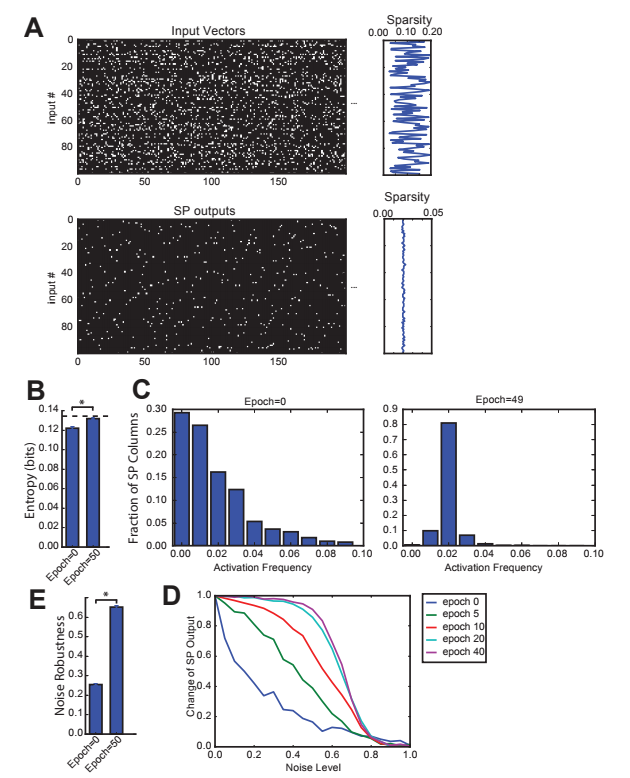
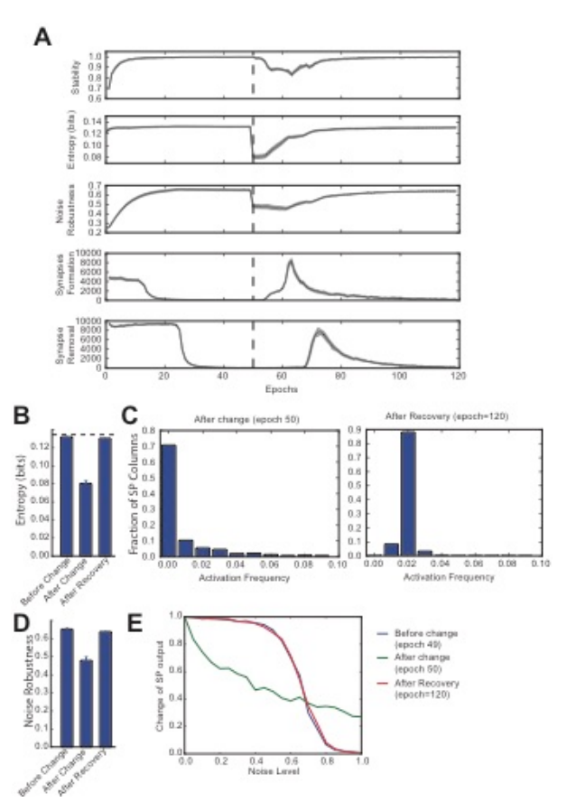
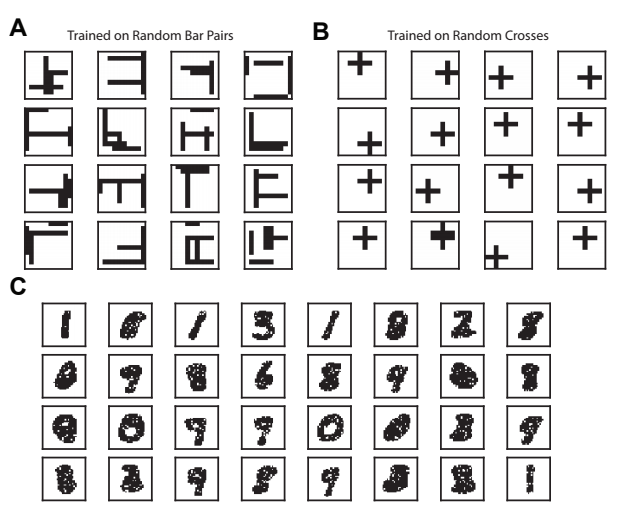
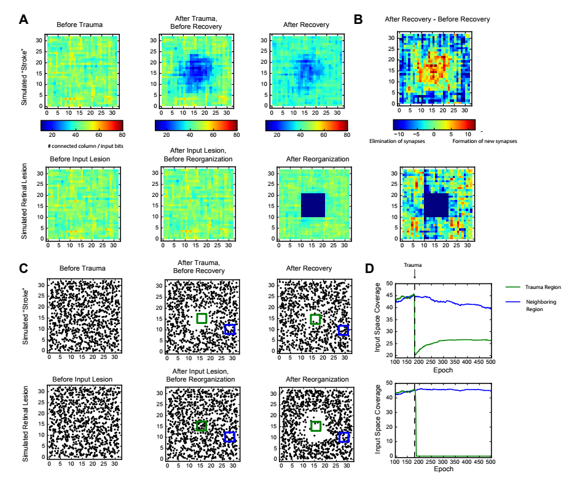
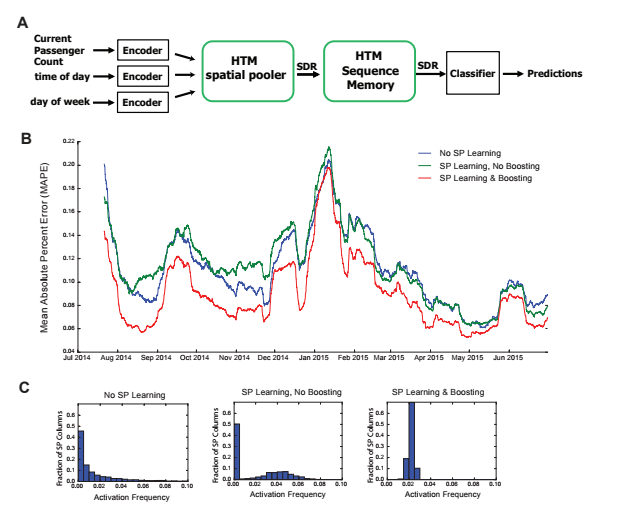
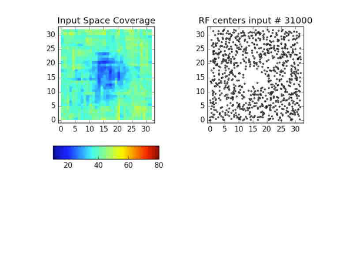
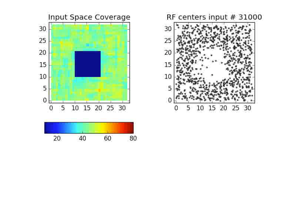

#### [The HTM Spatial Pooler: A Neocortical Algorithm for Online Sparse Distributed Coding   Yuwei Cui, Subutai Ahmad & Jeff Hawkins   Preprint of journal submission • 2017/02/16][6]
--------------------------------------------------------------------------------

## Figure 2

> Figure 2 Spatial pooler forms SDRs with fixed sparsity
and good noise robustness. A. We trained SP on a set of 100
randomly generated inputs (top). The input sparsity varies
between 2% to 20%. The sparsity of the SP output lies close
to 2% (bottom), despite the large variation of input sparsity.
B. Entropy before and after learning, averaged across 10
repeated experiments (* p<10-16, n=10, paired t-test). The
maximum possible entropy is shown as the black dashed line.
C. The distribution of activation frequency of SP minicolumns.
Before learning (left), a significant fraction of the
SP mini-columns (~30%) are not being used at all, while
other mini-columns are active much more frequently. After
learning (right), almost every mini-column is active for 2% of
the time, suggesting every SP mini-column participate in
representing the input. As a result, the entropy of the
distribution is much higher. D-E Noise robustness of SP. We
tested SP on noisy inputs during learning. D. The change of
the SP outputs is plotted as a function of the noise level.
Before learning, a small amount of noise will lead to
significant change in the SP output (blue), whereas after
learning, there is almost no change in the SP output when
50% of the input bits changed. E. Average noise robustness
before and after learning (* p<10-16, n=10, paired t-test).

## Figure 3

> Figure 3 Continuous learning with HTM spatial pooler.
SP continuously adapts to the statistics of the input data. SP is
trained on a set of random inputs (described in Fig. 2) until it
stabilizes. We then switch to a new set of inputs (black dashed
line) and monitor the continuous adaptation of SP to the new
dataset. A. Statistical metrics on SP during continuous
learning: top: stability, 2nd row: entropy; 3rd row: noise
robustness; 4th row: formation of new synapses; 5th row:
removal of synapses. B. The entropy decreases right after the
change of the input dataset (epoch=50), and recovers
completely after the SP is trained on the new dataset for long
enough time (epoch=120). The black dashed line showed the
theoretical limit for entropy given the sparsity constraint. C.
Distribution of activation frequency of SP mini-columns right
after the change in dataset (left) and after recovery (right). D.
Noise robustness before change (epoch=49), right after
change (epoch=50) and after recovery (epoch=120). E. The
noise robustness decreases right after the change of the input
dataset (blue vs. green), and recovers completely after the SP
is trained on the new dataset for long enough time (red).

## Figure 4

> Figure 4 Example receptive fields of SP. The receptive
fields of SP mini-columns capture statistics of the input data.
We define receptive field as the set of inputs that are
connected to a mini-column. A. Example SP Receptive fields
trained on random bar pairs. B. Example SP receptive fields
trained on random crosses. C. Example SP receptive fields
trained on MNIST dataset.

## Figure 5

> Figure 5 Recovery of HTM spatial pooler after damage and input lesion. During the simulated stroke, a fraction of SP
mini-columns that are connected to the center region of the input space is killed. During the simulated retinal lesion, the
center portion of the input space is blocked while the spatial pooler and its feedforward inputs are kept intact. A. The
number of SP mini-columns connected to each input bits before trauma (left), right after trauma (middle) and after recovery
(right). The simulated stroke experiment is shown at the top and the simulated retinal lesion experiment is shown at the
bottom. B. Growth and elimination of synapses during the recovery process for the simulated stroke (top) and retinal lesion
(bottom) experiment. C. Receptive field centers of all SP mini-columns before trauma (left), right after trauma (middle) and
after recovery (right). D. Number of mini-columns connected to the center region (green square in Fig. 5C) and a
neighboring region (blue square) during the recovery process. The recovery is very fast for the retinal lesion experiment
(bottom), and slower for the simulated stroke experiment (top)

## Figure 6

> Figure 6 The role of HTM spatial pooler in prediction task.
A. A complete HTM system of encoder -> spatial pooler ->
sequence memory -> classifier is used for predicting the NYC
taxi passenger count. B. Prediction error with an untrained
random SP (blue), a SP with continuous learning but without
boosting (green), and a SP with both continuous learning and
boosting (red). C. Distribution of activation frequency of SP
mini-columns. A large fraction of SP mini-columns are not
being used for an untrained SP or for a SP without boosting.
In contrast, almost all mini-columns are active for about 2%
of the time when boosting is enabled.

## Supplemental Movies
1. 
2. 

[6]: http://www.biorxiv.org/content/early/2017/02/16/085035
