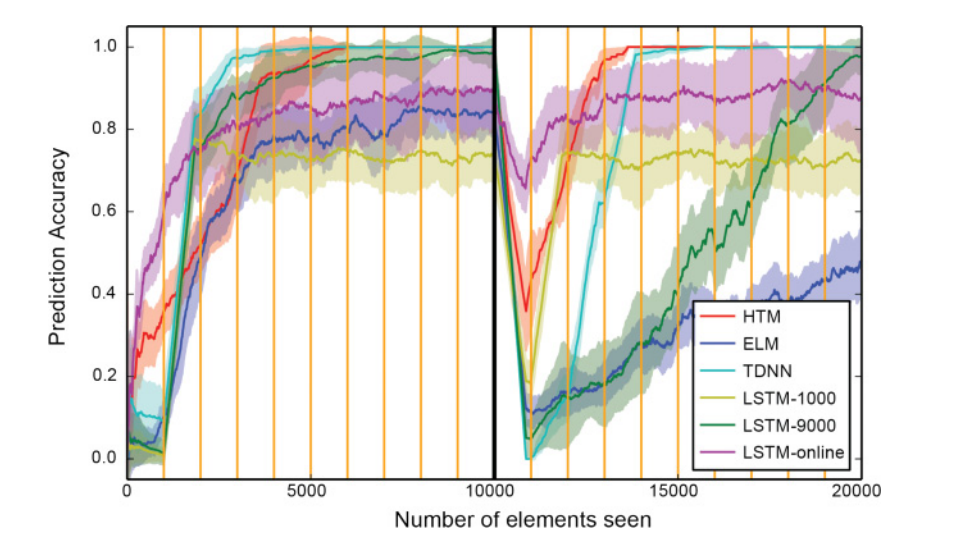
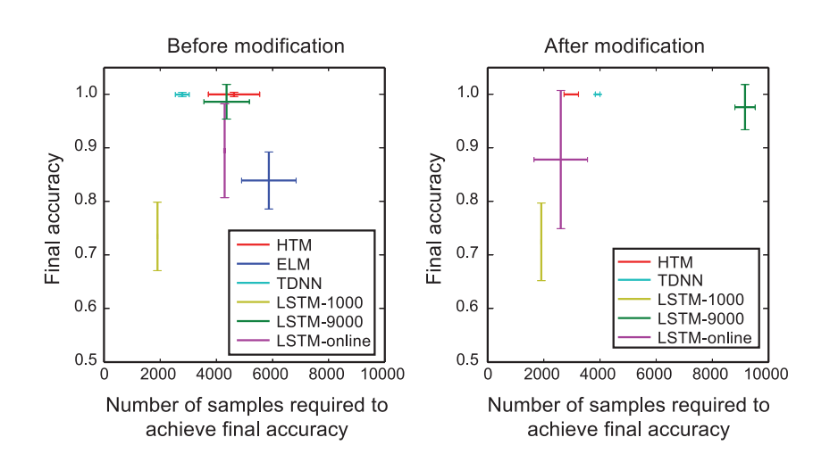
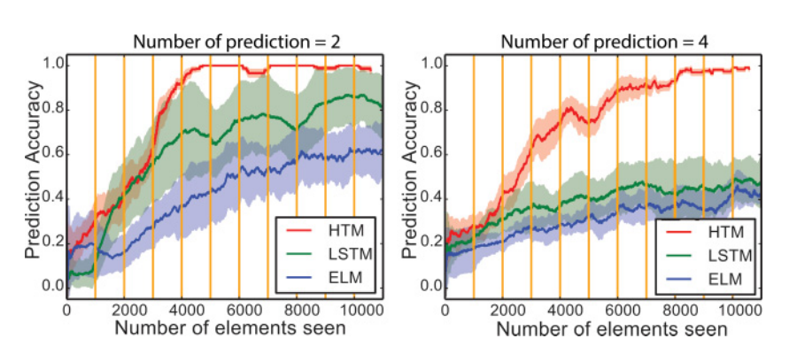
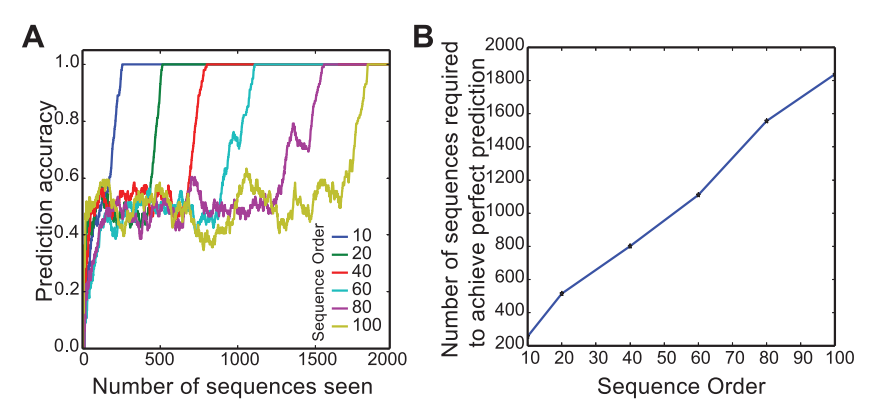
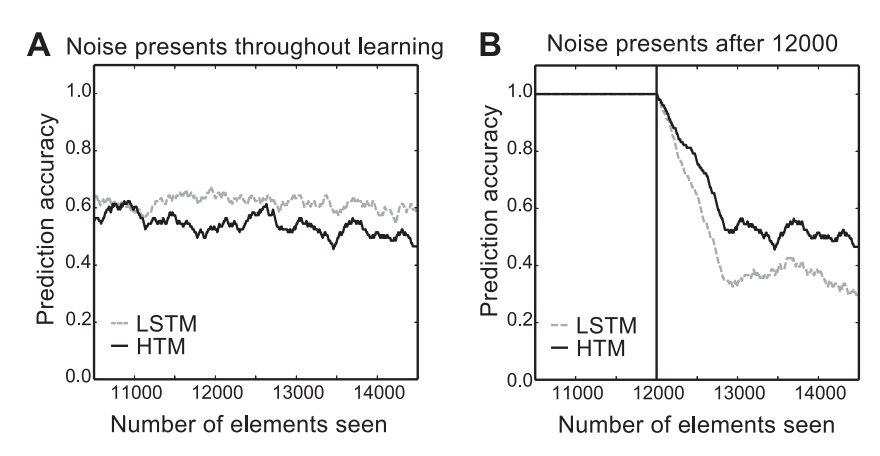
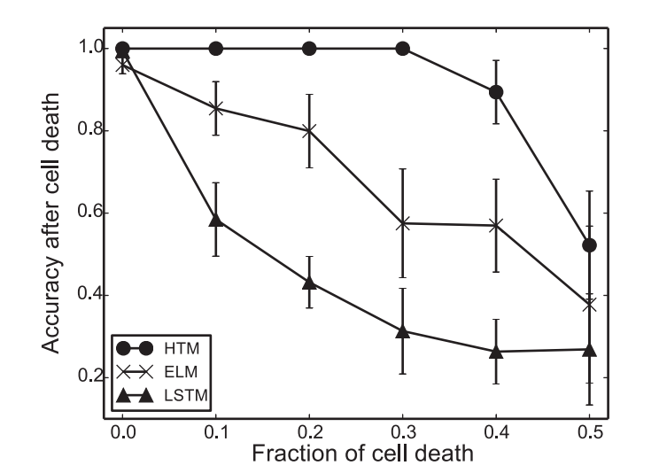
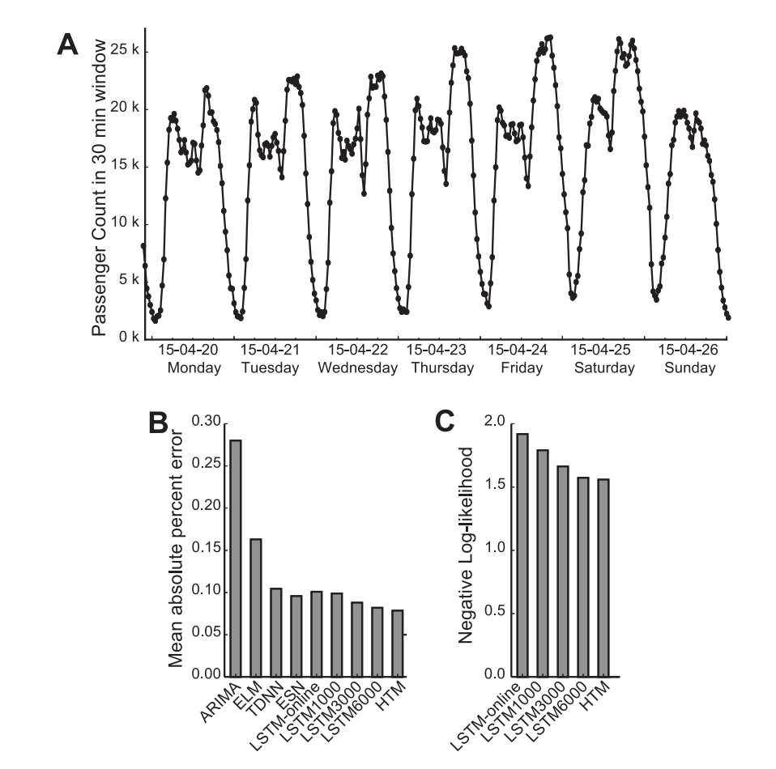
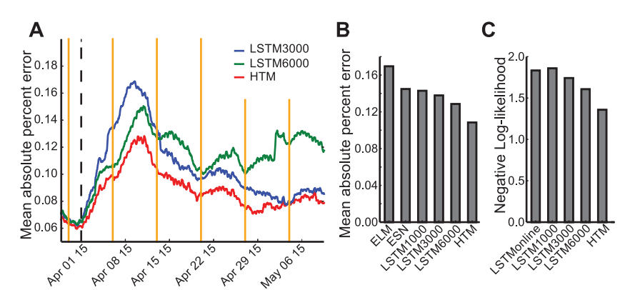

#### [Continuous Online Sequence Learning with an Unsupervised Neural Network Model   Yuwei Cui, Subutai Ahmad & Jeff Hawkins   Neural Computation, November 2016, Vol 2- No. 11 • 2016/11/01][8]
--------------------------------------------------------------------------------
## Figure 4

> Prediction accuracy of HTM (red), LSTM (yellow, green, purple), ELM
(blue), and TDNN (cyan) on an artificial data set. The data set contains four
sixth order sequences and four seventh order sequences. Prediction accuracy
is calculated as a moving average over the last 100 sequences. The sequences
are changed after 10,000 elements have been seen (black dashed line). HTM
sees each element once and learns continuously. ELM is trained continuously
using a time lag of 10 steps. TDNN is retrained every 1000 elements (orange
vertical lines) on the last 1000 elements (cyan). LSTM is either retrained every
1000 elements on the last 1000 elements (yellow) or 9000 elements (green), or
continuously adapted using truncated BPTT (purple).

## Figure 5

> Final prediction accuracy as a function of the number of samples
required to achieve final accuracy before (left) and after (right) modification of
the sequences. Error bars represent standard deviations.

## Figure 6

>  Performance on high-order sequence prediction tasks that require
two (left) or four (right) simultaneous predictions. Shaded regions represent
standard deviations (calculated with different sets of sequences). The data set
contains four sets of sixth order sequences and four sets of seventh-order sequences.

## Figure 7

> (A) Prediction accuracy over learning with sequences of different
orders. (B) Number of sequences required to achieve perfect prediction as a
function of sequence order. The sequence data set contains four high-order
sequences with the structure shown in Figure 3A.

## Figure 8

> (A) Prediction accuracy over learning with the presence of temporal
noise for LSTM (gray) and HTM (black). (B) HTM and LSTM are trained with
clean sequences. Temporal noise was added after 12,000 elements. The sequence
data set is same as in Figure 4.

## Figure 9

> Robustness of the network to damage. The prediction accuracy after
cell death is shown as a function of the fraction of cells that were removed
from the network.

## Figure 10

> Prediction of the New York City taxi passenger data. (A) Example
portion of taxi passenger data (aggregated at 30 min intervals). The data have
rich temporal patterns at both daily and weekly timescales. (B, C) Prediction
error of different sequence prediction algorithms using two metrics: mean
absolute percentage error (B), and negative log likelihood (C).

## Figure 11

> Prediction accuracy of LSTM and HTM after the introduction of
new patterns. (A). The mean absolute percent error of HTM sequence memory
(red) and LSTM networks (green, blue) after artificial manipulation of the data
(black dashed line). The LSTM networks are retrained every week at the yellow
vertical lines (B, C). Prediction error after the manipulation. HTM sequence
memory has better accuracy on both the MAPE and the negative log-likelihood
metrics.

[8]: http://www.mitpressjournals.org/doi/abs/10.1162/neco_a_00893#.wcej8ueri18
